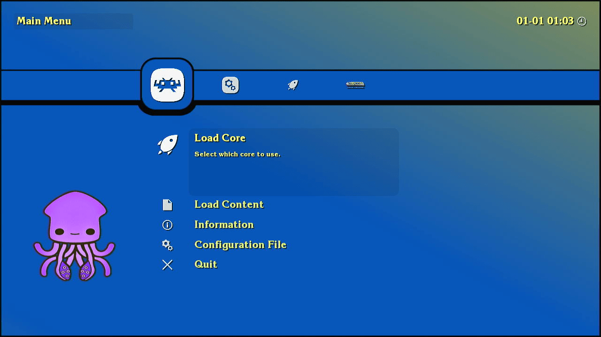

#
## Batocera 39-Choko - Capcom Home Arcade - Dual Boot Edition

This is the fork of [Batocera Linux](https://batocera.org) with a customized version for the [Capcom Home Arcade](https://capcomhomearcade.com) device.

It is the successor of our [CHA Multi OS Boot](https://github.com/ChokoGroup/CHA-Multi-OS-Boot) repository.

#

#

## What is special about batocera 39-Choko?

- It's a dual boot system image with both official OS v1.71 and Batocera 39. The img file can be written either in [eMMC](https://github.com/lilo-san/cha-documentation#installing-software) or [SD card](https://github.com/lilo-san/cha-documentation#hardware-modifications), using [BalenaEtcher](https://etcher.balena.io), or similar program.

- We can use Emulation Station (Batocera style UI) or RetroArch (Lakka style UI).

- Scanlines shader crt/GritsScanlines enabled by default for both Emulation Station and RetroArch.

- Possibility to download and install future updates from our repository without the need of a computer.

- Use swap partition, if found, or create a swap file to expand available memory, if CHOKO_DISK partition exists or if running from SD card.

- Similar to what is done in Lakka, we can add/update cores copying them to `/userdata/system/configs/retroarch/cores` (browsing in your network is `\\BATOCERA\share\system\configs\retroarch\cores`). Check the bottom of this page for a list of important folders.

#

#

Compared to official Official Batocera 39, this version has some new or updated packages:

- RetroArch and libretro-core-info v1.18.0 (instead of v1.16.0).

- FBalpha2012 libretro core added.

- FB Neo libretro core updated to 2024-03-22 version.

#

#

To save some space (needed to support future online updates), some packages were removed:

- Removed support for Wiimotes, joycons, wheels, pixelcade and similar screens, switchres, probably other less usual stuff...

- Removed many standalone emulators that also had libretro cores, like SCUMMVM and flash player.

- Removed most of handhelds emulators.

#

#

## Notes

- Batocera is demanding, and we strongly advise to install a fan over the heatsink. When the CHA overheats it becomes slower and crashes.

- root password changed to "Choko" (to match the password used in official OS and Choko Hack and because it might be a bit more secure to avoid the well known default password). Read https://wiki.batocera.org/security to know more and how to change the password.

- The first time the system boots, it will check if it is running from SD card. If it is running from SD card, it will change the partition labels to CHA_BOOT_SD, CHA_DISK_SD and BATOCERA_DISK_SD to avoid conflicts with systems installed in eMMC.

- Booting into Batocera takes some time, especially if loading from USB. The first boot can take a minute or more.

- After booting once into Batocera, and if you are not using SD card, you should select an USB disk to be used following [this instructions](https://wiki.batocera.org/store_games_on_a_second_usb_sata_drive).

- Currently, it is not possible to configure Wi-Fi or disable/enable shaders globally from RetroArch. You must boot into EmulationStation to set Wi-Fi or to disable/enable shaders. RetroArch can set shaders for each core, if they are disabled globally.

- Future system updates, when available, can be done with Emulation Station (not in RetroArch).

- To create playlists in RetroArch, follow the steps in this video:

https://github.com/ChokoGroup/batocera-CHA/assets/55603581/d186a511-9a27-4adc-8918-d04606aecae1

- Take in consideration that RetroArch's thumbnails downloader is very basic.
In "Manual Scan" -> "System Name" select "Custom" and then in "Custom System Name" write exactly the name of the closest folder in [their servers](https://thumbnails.libretro.com/).
Notice, for example, that is `MAME` folder and NOT "mame". For fbneo games, "Custom System Name" must be exactly `FBNeo - Arcade Games`.

https://github.com/ChokoGroup/batocera-CHA/assets/55603581/3e674fc9-564e-42d9-a5a1-efd9136e0469

- One last note. about the use of a partition named `CHOKO_DISK`: it is still supported, but not really important now that we don't have to share roms and assets between Batorcera and Lakka. Also, Batocera can use USB disks formatted in FAT32 natively.

#

## Important folders

| Path on partition (mounted under /userdata ) | Path on network (for Windows) | Use and Notes |
| --- | --- | --- |
| /bios | \\\\BATOCERA\\share\\bios | BIOS files required for some emulators; https://wiki.batocera.org/add_games_bios#adding_bios_files |
| /cheats | \\\\BATOCERA\\share\\cheats | "cht" and "saves" folders for using cheats in RetroArch; https://docs.libretro.com/guides/cheat-codes/ |
| /decorations | \\\\BATOCERA\\share\\decorations | Bezels and overlays; https://wiki.batocera.org/decoration |
| /music | \\\\BATOCERA\\share\\music | Emulation Station music; https://wiki.batocera.org/emulationstation:music |
| /roms | \\\\BATOCERA\\share\\roms | Folders with games for each supported emulator/system; https://wiki.batocera.org/add_games_bios#adding_roms |
| /saves | \\\\BATOCERA\\share\\saves | Folders with savegames and savestates. |
| /screenshots | \\\\BATOCERA\\share\\screenshots | Folders with screenshots taken from games. |
| /splash | \\\\BATOCERA\\share\\splash | Custom images/videos to show while booting; https://wiki.batocera.org/splash_boot |
| /system/upgrade | \\\\BATOCERA\\share\\system\\upgrade | Used to download "boot.tar.xz" for upgrading Batocera; https://wiki.batocera.org/upgrade_manually |
| /system/configs/retroarch/config | \\\\BATOCERA\\share\\system\\configs\\retroarch\\config | Is where RetroArch saves remmapping files and overlays \*.cfg |
| /system/configs/retroarch/playlists | \\\\BATOCERA\\share\\system\\configs\\retroarch\\playlists | Playlists for RetroArch; https://docs.libretro.com/guides/roms-playlists-thumbnails/ |
| /system/configs/retroarch/thumbnails | \\\\BATOCERA\\share\\system\\configs\\retroarch\\thumbnails | Thumbnails for RetroArch' playlists; https://docs.libretro.com/guides/roms-playlists-thumbnails/ |
| /system/configs/retroarch/assets | \\\\BATOCERA\\share\\system\\configs\\retroarch\\assets | Assets for RetroArch' menus (icons). |
| /system/configs/retroarch/cores | \\\\BATOCERA\\share\\system\\configs\\retroarch\\cores | Libretro cores (\*.so files); Files here will add or replace existing cores. |
| /system/configs/retroarch/cores-info | \\\\BATOCERA\\share\\system\\configs\\retroarch\\cores-info | \*.info file for cores; Files here will add or replace existing info files. |

#

## Known issues

- On rare ocasions, SD card and eMMC change order at boot (no idea why). When that happens, an error message is displayed asking to unplug the power cable and try again a couple of minutes later.

- Sometimes a game crashes when starting, going back to UI (Emulation Station or RetroArch). Trying again usually runs the game without issues. This usually happens when changing games frequently.
